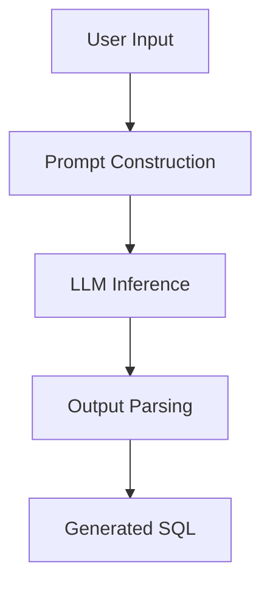

# ChainQuery AI Agent Architecture 🧠

This document details the internal **AI Agent** architecture that powers ChainQuery AI. The system uses **LangGraph** (built on LangChain) to orchestrate the thinking process required to convert natural language into valid DuneSQL (Trino) queries for the Solana blockchain.

## 🏗️ Architecture Overview

The core intelligence is NOT a simple LLM call. It is a stateful graph that manages context, prompt engineering, and structured output generation.



---

## 🧩 Components

### 1. The State (`AgentState`)
The agent maintains a state object throughout the lifecycle of a request:

```python
class AgentState(TypedDict):
    user_input: str      # "Show me NFT sales"
    sql_output: str      # "SELECT * FROM..."
    error: Optional[str] # Any processing errors
```

### 2. The Nodes

#### **Prompt Construction Node**
- **Function**: `app/agent/nodes.py`
- **Role**: Combines the user's natural language input with the **System Prompt**.
- **Context Stuffing**: Injects key knowledge about:
  - **Dialect**: DuneSQL (Trino) specific syntax (`try_cast`, `bytearray` handling).
  - **Schema**: Key tables like `solana.transactions`, `nft.trades`, `tokens.transfers`.
  - **Rules**: "Always limit to 10 rows", "Use human-readable layouts".

#### **LLM Inference Node**
- **Function**: Calls the AI Provider.
- **Models Supported**:
  - `gpt-4o` (OpenAI)
  - `llama-3.1` (Groq)
- **Settings**: Temperature `0` (Deterministic code generation).

### 3. The Graph (`workflow.py`)
LangGraph defines the execution flow:

```python
workflow = StateGraph(AgentState)
workflow.add_node("generate_query", generate_query_node)
workflow.set_entry_point("generate_query")
workflow.add_edge("generate_query", END)
```

---

## 📝 Prompt Engineering strategy

The system uses a **role-based prompting** strategy:

> "You are an expert Solana Blockchain data analyst utilizing Dune Analytics. Your goal is to generate optimized DuneSQL queries..."

### Key Instructions:
1.  **Format Constraints**: Markdown code blocks only.
2.  **Date Handling**: Use `INTERVAL '1' DAY` syntax valid in Trino.
3.  **Address Handling**: Correctly handle Solana base58 addresses vs byte arrays.

---

## 🔮 Future Agent Capabilities (Roadmap)

The graph architecture allows us to add complexity later without rewriting the core logic:

- [ ] **Validation Node**: Execute a "Dry Run" or syntax check before returning.
- [ ] **Reflection Node**: If SQL fails, feed the error back to the LLM to fix it.
- [ ] **RAG Node**: Look up specific contract addresses (e.g., "Jupiter Aggregator") from a vector DB.
